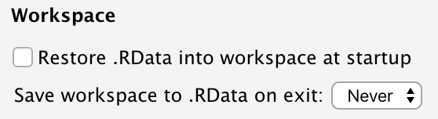

# ZIG GLEON

Welcome to the ZIG GLEON Data Harmonization Team git repo! The goals of the data team are to:

* Create a raw analysis-ready data product from submitted datasets
* Provide scripted workflows for each step of data cleaning
* Perform high level QC of submitted data

This README includes the data sharing policy, git repo structure, proposed workflow, suggested packages, and more. Please see the scripts folder [README](scripts/README.md) for more information on cleaning and performing QC check on an individual dataset and an example script. 

Please use Github [Issues](https://github.com/sfigary/GLEON_ZIG/issues) or feel free to reach out to Michael Meyer (michael.f.meyer@wsu.edu), Steph Figary (sef92@cornell.edu) or Warren Currie (warren.currie@dfo-mpo.gc.ca) if you have any questions.  

 

## Table of contents
* [Data policy](#data-policy)
* [Repo structure](#repo-structure)
* [Proposed workflow](#proposed-workflow)
* [Suggested packages, versions, and R practices](#suggested-packages-versions-and-R-practices)
* [Github resources](#github-resources)
* [Thank you!](#thank-you)

 

## Data Policy

ZIG's data sharing policy is that data will not be shared without permission from the data provider. Please do not share any data that you are given access to as a member of the Data Harmonization Team. Please see our [Authorship Guidelines and Data Policy](https://docs.google.com/document/d/1v-Wg50qSCBuFWXFg-B3PdfiEKz__8iJr3IeyCUpfKgU/edit?usp=sharing) for more details.

 

## Repo structure

This repo is organized with three main folders and several subfolders. 

* Data:
  + Inputs: **Do not edit!** This folder includes the original data files from data providers. Michael or Steph will assign datasets to  members of the Date Team. Please see the [data submission form](https://docs.google.com/spreadsheets/d/1QrXnV7tFMUeL_8aAWt7KZfKNVz0GH7NGw8LR8UsK-qw/edit?usp=sharing) for information on each dataset you receive. This includes any additional information the data providers wanted the Data Harmonization Team to know. 
  + derived_products: Each dataset will have a subfolder that contains the cleans .csv's and a `README` that describes the data cleaning process and important information. 

* Scripts: This folder includes all of the scripts that are used to clean each dataset and create one final dataset for analysis (later step). 

* Figures: This folder includes all of the figures used in the qc checks, including histograms, scatterplots, and others. Each dataset will have a subfolder and data cleaning scripts should write the figures here.

Note: If you clone this repo to your computer you will have access to all of the files. **Please only edit your own script and do not change the folder structure of this repo.**

 

## Proposed workflow/Github issues 

Michael and Steph will use Github [Issues](https://github.com/sfigary/GLEON_ZIG/issues) to assign datasets to team members. The datasets will be located in the `data/inputs`. No one will work on their own dataset to ensure each dataset is looked over with a new pair of eyes. Scripts for data cleaning and qc checks will be kept in the `scripts` folder and will write output to the `data/derived_products` and `figures` folders. 

We will use Github [Issues](https://github.com/sfigary/GLEON_ZIG/issues) for project management, troubleshooting, team communications, and tracking progress. There are many benefits to using Issues, including maintaining a record of data cleaning decisions in one location that everyone in the Data Team can see and comment on. If you are interested in learning more about Github [Issues](https://github.com/sfigary/GLEON_ZIG/issues), please see Chapter 10 in [GitHub for Project Management by Openscapes.](https://openscapes.github.io/series/github-issues.html)

The landing page README in the scripts folder includes much more information on how-to clean a dataset.

 

## Suggested packages, versions, and R practices

* `tidyverse` >= 1.3.0
* `readxl` >= 1.3.0
* Please set your RStudio -> Preferences -> General to "never restore or save the workspace (.RData)" 

 

## Github resources

We are using Github for version control and communication/troubleshooting through Issues. If you're new to Github, here are some resources to help get you started:

* [Git in R:](https://nt246.github.io/NTRES-6100-data-science/lesson2-rmarkdown-github.html) Lecture notes from Dr. Nina Overgaard Therkildsen's Collaborative and Reproducible Data Science in R course at Cornell University. Lessons 2-5 provide step-by-step instructions for setting up Github and pairing it with Rstudio. These links are shared with permission from Dr. Nina Overgaard Therkildsen.
* [GLEON's GitHub workshop](https://www.youtube.com/watch?v=B-FHx4l1BNU) by Joe Stachelek
* [Jenny Bryan’s Happy Git with R:](https://happygitwithr.com/big-picture.html) Chapter 1 introduces Git and its benefits.
* [GitHub for Project Management by Openscapes:](https://openscapes.github.io/series/github-issues.html) Chapter 10 includes an overview of Git Issues.

 

## Thank you!

Thank you all for volunteering your time to keep ZIG moving forward by joining the Data Harmonization Team! This is a vital step for both producing a data paper and getting to the next step of data analysis.

Updated: 7July2021